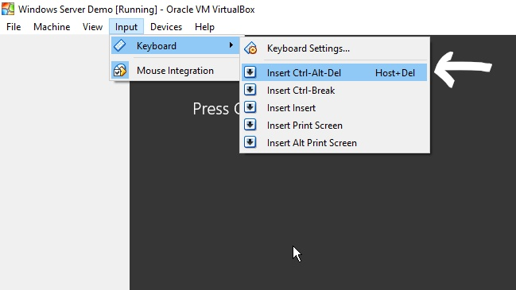
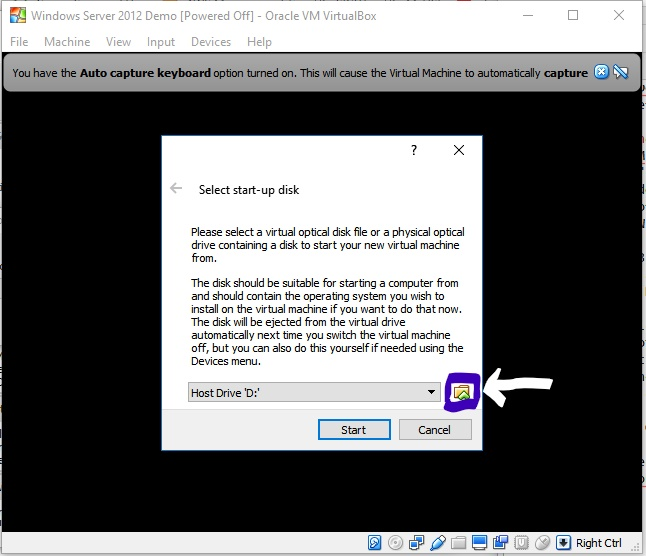
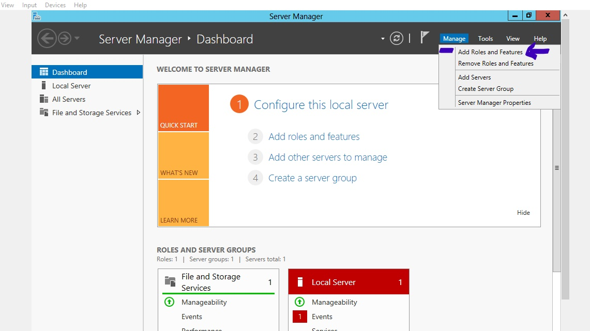
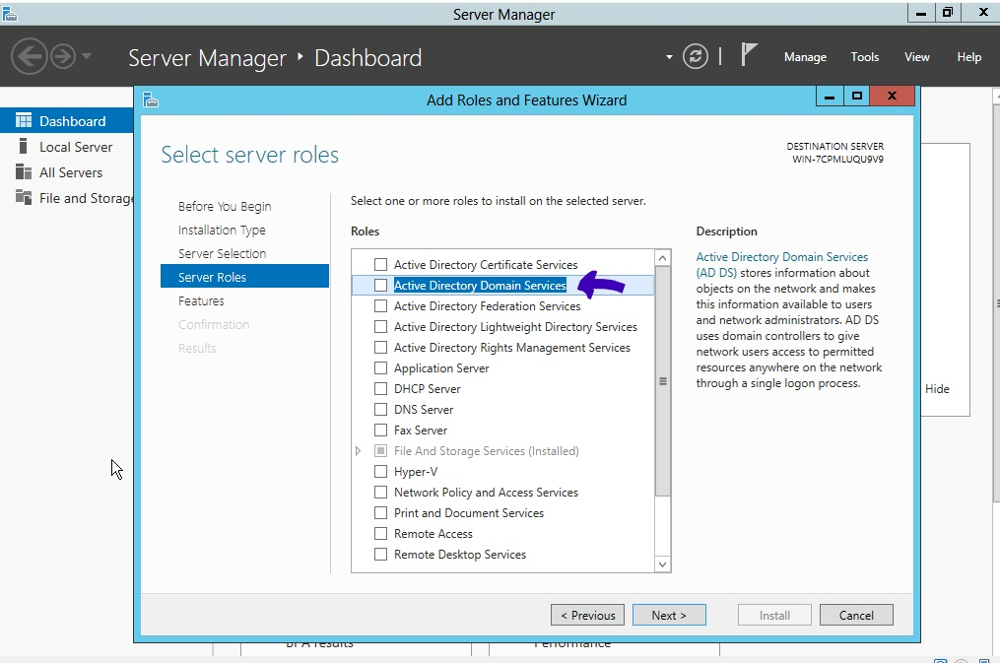
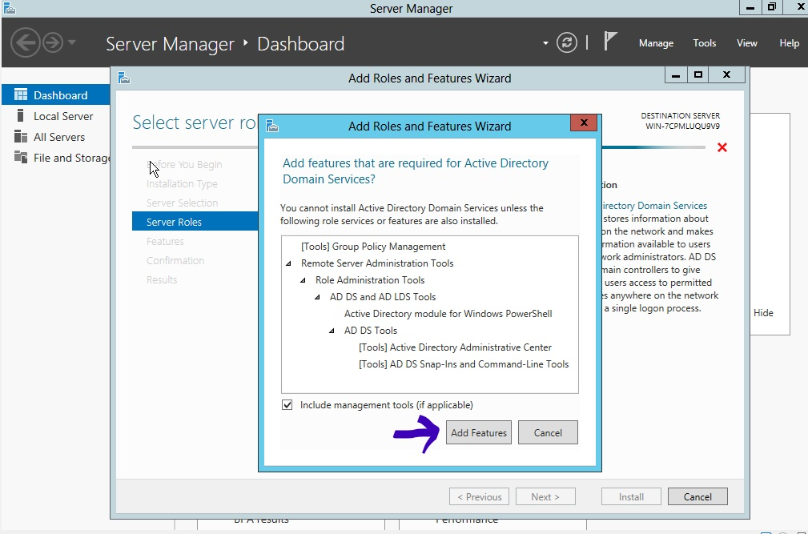
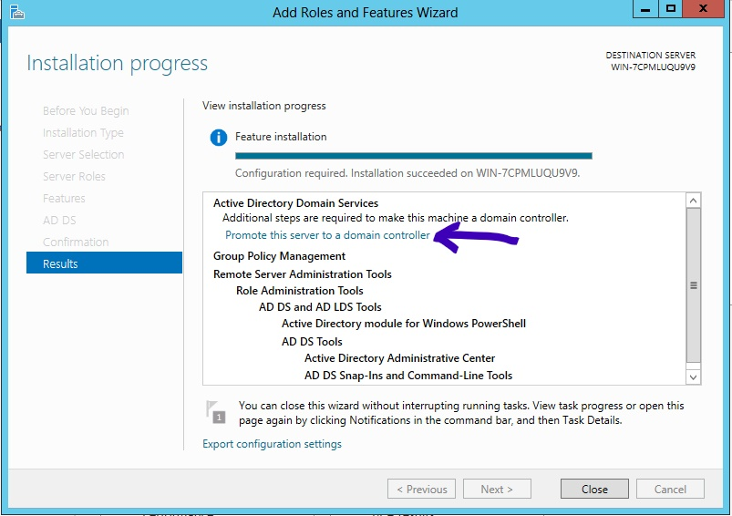
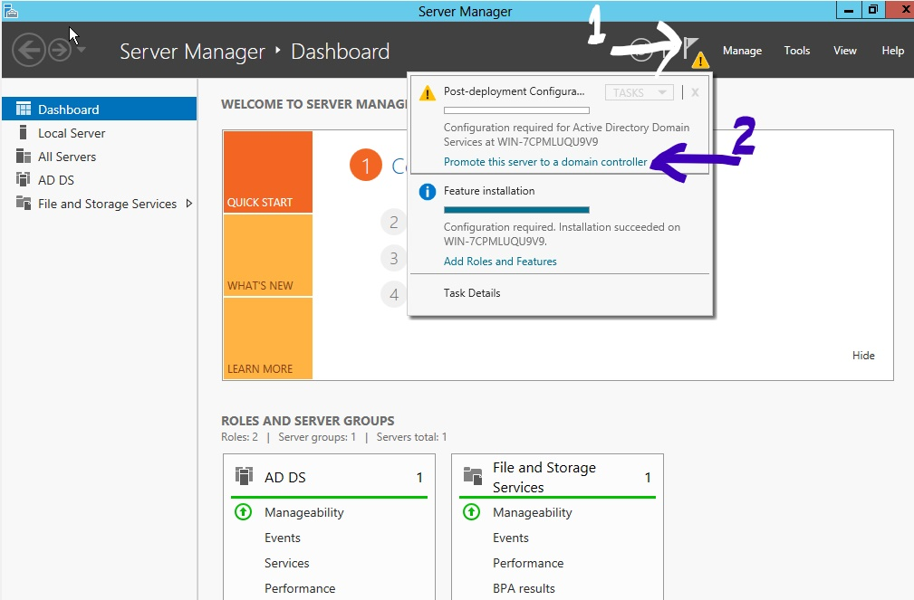
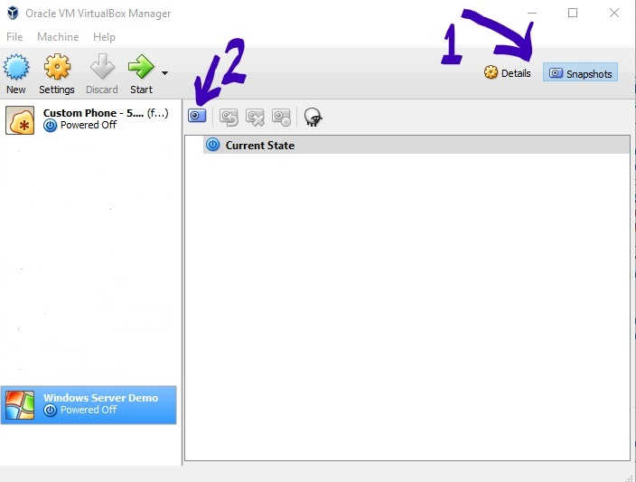

### Contact
- Slack: @Mayank Yadav on wcscusf.slack.com
- Email: mayanky@mail.usf.edu

### Table of Content
1. [Download Windows Server 2012](#download_windows_server)
2. [Download Oracle VM Virtual Box](#download_vm)
3. [Installing Oracle VM Virtual Box](#install_vm)
4. [Installing Windows Server 2012](#install_windows_server)
5. [Installing Services on Windows Server 2012](#install_services)
6. [Save Windows Server Current State](#save_vm_current_state)

<i><u>Note</u>: The Windows Server 2012 is a 64 bit OS, Windows Server 2008 was the last 32 bit Windows Server</i>

## Download Windows Server 2012 
1. Download the Windows Server 2012 from following link: <a href="https://www.microsoft.com/en-us/evalcenter/evaluate-windows-server-2012" target="_blank">Download Link</a>
2. Click on Windows Server 2012
3. Select File Type as ISO (An ISO image is an archive file of an optical disc).
4. Click Continue
5. Enter the required details and Click on Continue
6. Select Language. (Recommended: English)
7. Click Download
8. A file of 3.44 GB approx will start to download automatically, if the download does not start click on download link again.

## Download Oracle VM Virtual Box 
1. Download Virtual Box from following link: <a href="https://www.virtualbox.org/wiki/Downloads" target="_blank">Download Link</a>
 <u>Note</u>: Want to know more about Virtual Box: <a href="https://www.virtualbox.org/manual/ch01.html" target="_blank">Click Me</a>
2. Select the platform package according to your machine's Operating System.

## Installing Oracle VM Virtual Box 
1. Click on the Downloaded  Virtual Box executable file.
2. Go with the default options selected

## Installing Windows Server 2012 
 <i><u>Note</u>: If you need to Enter Ctrl + Alt + Del in VM, go to Input -> Keyboard -> Insert Clrl-Alt-Del</i>

1. Open Oracle VM VirtualBox
2. Click on "New"
3. Name your Windows Server 2012 Machine as you prefer
4. Select Microsoft Windows as Type
5. Select Other Windows (64-bit) as Version
6. Click Next
7. Select 2048 MB as Memory Size
8. Select Create a virtual hard disk now as Hard disk
9. Select VDI as Hard disk file type
10. Click Next
11. Select Dynamically allocated (This will initially be very small and not occupy any space for unused virtual disk sectors, but will dynamically occupy disk sector when required, until the drive reaches the maximum capacity). 
12. Click Next
13. Select 40.00 GB as Size
14. Click Next
15. Select the recent created VM
	 <b>Optional</b> - <i>Access Internet from VM Machine 
	Click Settings Go to Network Go to Adapter 2 
	Check the Check Box of "Enable Network Adapter" 
	Select Host-only Adapter in Attached to 
	Go to Advanced -> Promiscuous Mode: Allow All 
	Check the Cable Connected CheckBox 
	<u>Note</u>: Promiscuous Mode - Allows you to see all network traffic traversing the virtual switch</i>
16. Click Start
17. Browse to the Downloaded Windows Sever 2012 ISO file
  
18. Click Start
19. Click Next
20. Click Install Now
21. Select Windows Server 2012 Standard Evaluation (Server with a GUI) -> Click Next. It will probably be second option. GUI stands for Graphical User Interface. We selected the GUI option as  the Server Core Install option will install the Windows Server 2012 in Command Mode, but for this tutorial we will be using GUI version of Windows Server.
22. Check I accept the license terms option
23. Click Custom
24. Click Next
25. The Windows will start to Install 
26. Windows will restart
27. When the windows is starting -> Click on Devices from Tool Bar of the running VM -> Click on Optical Drivers -> Click Remove Disk
28. The machine might restart again by itself
29. Create a super secret Password
30. Click Finish
31. Go to Input in Tool Bar of the running VM -> Keyboard -> Insert Ctrl-Alt-Del
32. Enter your created password
33. Congratulations! Windows Server 2012 is successfully installed

##Installing Services on Windows Server 2012 
1. Open Server Manager.  <b>Optional</b> - <i>Change Server Name  Click on Local Server -> Click on the Value Specified for the field Computer Name -> In System Properties -> Computer Name -> Click Change -> Change the value specified for the field Computer Name (Example: SERVER) -> Once you have renamed your server, Click OK -> In order to fully change the name, system might have to restart. Therefore if prompted a message of "You must restart your computer to apply these changes", Click OK -> Restart Now.
 <u>Note:</u> You might see only 4 options (Dashboard, Local Server, All Servers, File and Storage Services) on Left Bar initially but as you install services the options on Left Bar will increase accordingly.</i>
2. Click on Manage (Located in Top Left)
3. Go to Add Roles and Features
	  
4. Before you Begin -> Click Next
5. Installation Type -> Role-based or feature-based installation -> Click Next
6. Server Selection -> Click Next
7. Server Roles -> Check Active Directory Domain Services 	-> A message box will be prompted, Click Add Features.
	 Active Directory is a centralized and standardized system that automates network management of user data, security, resources, and enables interaction with other directories. <i><u>Note</u>: Want to know more about Active Directory: <a href="https://en.wikipedia.org/wiki/Active_Directory" target="_blank">Click Me</a></i>
	  
	  
8. <b>Optional</b>: Server Roles -> DHCP Server -> A 	message box will be prompted, Click Add Features -> Continue 
	<i>Dynamic Host Configuration Protocol (DHCP) is a protocol that automatically provides an dynamic Internet Protocol (IP) to a system, along with configuration information such as the subnet mask and default gateway.
	 <u>Note</u>: Want to know how DHCP works: <a href="https://www.quora.com/How-does-DHCP-work" target="_blank">Click Me</a></i>
9. <b>Optional</b>: Server Roles -> DNS Server -> A message 	box will be prompted, Click Add Features -> Continue 
	<i>Domain Name System (DNS) maintains a directory of domain names and translate them to Internet Protocol (IP) addresses. <u>Note</u>: Want to know more about DNS: <a href="https://www.youtube.com/watch?v=72snZctFFtA" target="_blank">Click Me</a> </i>
10. Click Next
11. Features -> Click Next
12. AD DS -> Click Next
	 <b>Optional</b>: <i>DHCP Server -> Click Next</i>
	 <b>Optional</b>: <i>DNS Server -> Click Next</i>
13. Confirmation -> Click Install 
	This process will install all services required for runnig the Server Roles that we are adding. Also this step can take a while. If you have selected DNS and DHCP, expect around 30 minutes.
14. After the installation process has completed -> In Active Directory Domain Services -> Click Promote this server to a domain controller
	
15. If you missed Step-14, the alternative is, go to Notification (Located in Top Right with Manage, the symbol representation of the same is a FLAG)
	
16. An Active Directory Domain Services Configuration Wizard will open.
	
  <i>
<u>Note</u>: From this step, it may take a while to complete the current step and then go to the next step.</i>
17. Deployment Configuration -> Add a new forest.
	  Let's see why did we not select other options:  
Add a domain controller to an existing domain -> No, because we don't have a domain yet 
Add a new domain to an existing forest -> No, again we don't have an existing forest (A tree is a collection of one or more domains and domain trees in a contiguous namespace, linked in a transitive trust hierarchy. At the top of the structure is the forest.)
18. Deployment Configuration -> Root domain name: example.com -> Click Next  You have to specify ".com" or ".edu" or a TLD (Top Level Domain) with your domain name. For this lab environment, you don't have to own this domain, this is just for your internal network. You can go ahead with "microsoft.com". But if you are in a Business environment, use their Business Domain Name instead.
19. Domain Controller Options -> Create a super secret Password and Confirm Password -> Click Next
  If you are dealing with a business environment, make sure to check which server are they using as Domain and Forest and select the appropriate server for the same. In our case, we are building from scratch, therefore we can go with default Forest and Domain Level i.e., Windows Server 2012.
  Global Catalog - This option is selected as this domain is the first domain on the network and as this is the first domain on the network, it cannot be Read only Domain.
20. DNS Options -> Click Next
  This step might give a warning, it's related to not having DNS server. Its fine, we can ignore it.
21. Additional Options -> The NetBIOS domain name: EXAMPLE -> Click Next
  It is asking for NetBIOS domain name. NetBIOS was used in old system, therefore it's just like domain name from old days. The name has a limitation of 15 character. How to form a NetBIOS domain name -> Capitalize your root domain name and remove the Top Level Domain (TLD, Example:".com") from the end
22. Paths -> You can go with default -> Click Next
  AD is a like a Database, so it is asking for where the information for this should be stored.
23. Review Options -> Click Next
  This step is just asking whether you want to continue with the changes that you made
24. Prerequisites Check -> Click Install
  This step will verify that the components required for installing domain controller are available. Can take a while to check prerequisites. After the check is completed, a green check symbol will appear below "Prerequisites Check" Heading. It might give you some warning, but we can ignore it as none of them is an error therefore having a Red Cross. 
25. After you click install, it will go through and start installing required components. Can take a while to install all the required components.
26. The server might restart itself. That is fine, in windows if a major service or software is being installed or uninstalled, the system requires a restart so that it can make the changes in the required directories. You might observe some change in your Log-in Administration Name.
27. Now that the system has restarted, go to Server Manager. You can see AD DS and DNS (there were no DNS server in our domain, therefore it added the DNS Service in our Server) option added in the Left Bar and also if you click on Tools there will be some options added related to AD DS.
   
28. Click Local Server -> Observe under Domain, it shows the root domain name that we specified during AD installation, therefore "example.com". Now your computer name will be, if you also changed your Server Name to SERVER earlier, server@example.com.

##Save Windows Server Current State 
1. Close the running Windows Server 2012 VM.
2. Select your Windows Server 2012 from VirtualBox Manager.
3. Select Snapshots (located in top right with "Details")
4. Click on Take a snapshot
 
5. Provide a name of your snapshot. Also provide Description like Date, Services Installed, example: AD DS
6. Click OK
 The reason we created a snapshot of the current state is because if the Windows Server License Expire or something get messed up, we can come back to this state. 

<i><u>Note</u>: If you are facing some difficulty or error, message me on slack or e-mail me, I will try to get back to you as soon as possible.</i>